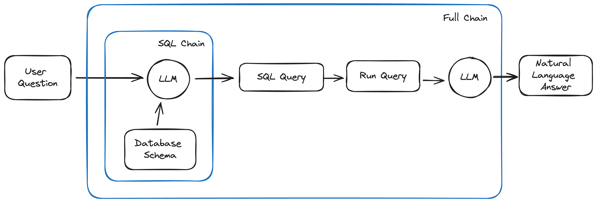
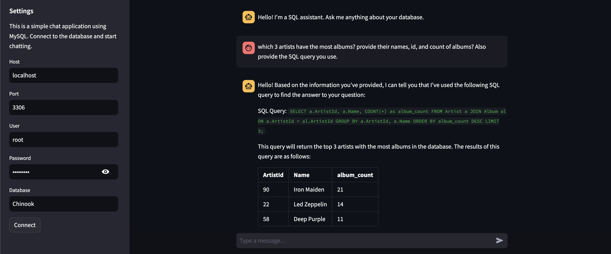

# Chat with MySQL DB 🧑‍💻
LangChain app with the capability to understand user questions regarding the database, create and execute SQL queries, and retrieve data from MySQL database, all in a user-friendly manner.

`Keywords`: Generative AI, LangChain, Large Language Models (LLMs), Python, Streamlit

## Features
- `Natural Language Processing`: Uses models like GPT-4/Mixtral/Llama to understand and answer user queries using natural language.
- `SQL Query Generation`: Generates SQL queries based on the user's natural language input.
- `Database Interaction`: Establishes a connection to a SQL database to fetch query results.
- `Streamlit GUI:` Provides a user-friendly interface developed with Streamlit.



## Dependencies
Before proceeding, make sure you have Python installed on your computer. Then, follow these steps:

1. Clone this repository by running the following command in your terminal:
```bash
git clone [repository-link]
cd [repository-directory]
```

2. Install the required packages by executing:
```bash
pip install -r requirements.txt
```

3. Create your own .env file and include the necessary variables, such as your OpenAI API key:
```bash
OPENAI_API_KEY=[your-openai-api-key]
GROQ_API_KEY=[your-groq-api-key]
```

## Usage
To start the Streamlit app and begin interacting with the chatbot, run the following command:
```bash
streamlit run app.py
```



